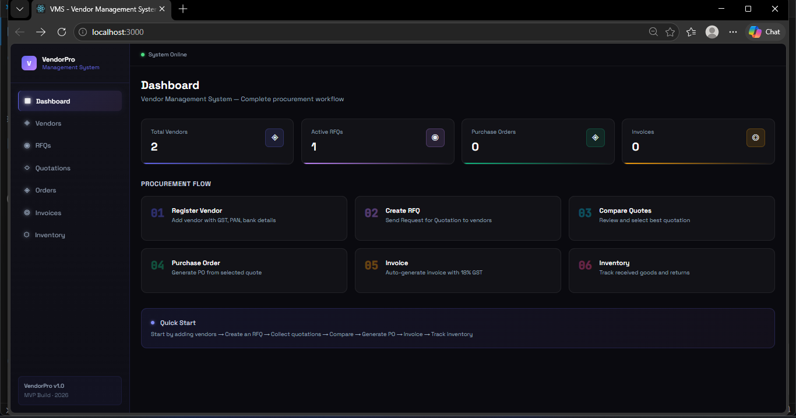
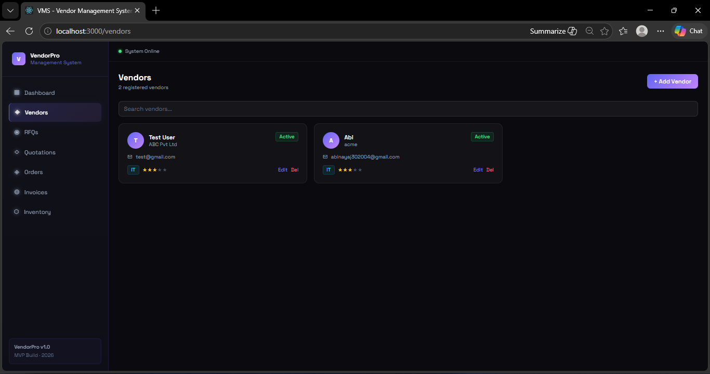
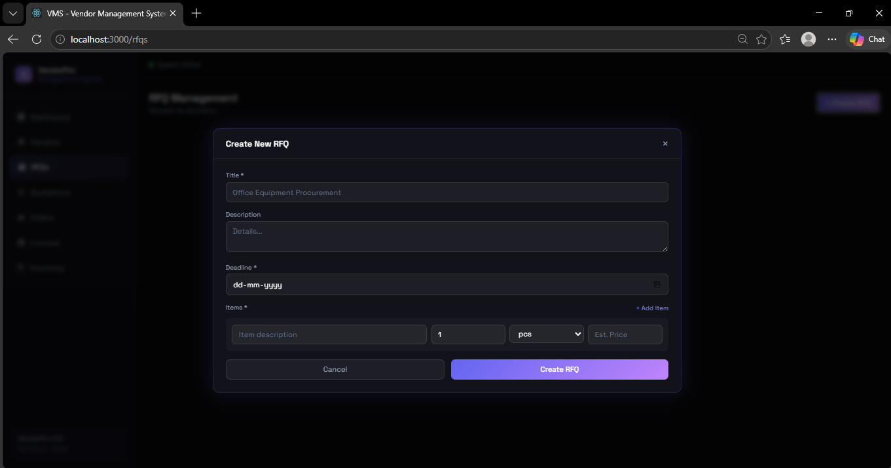
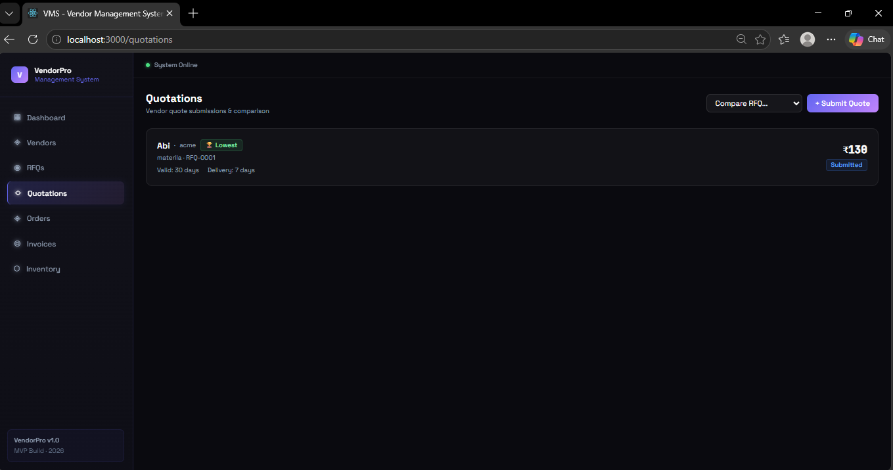
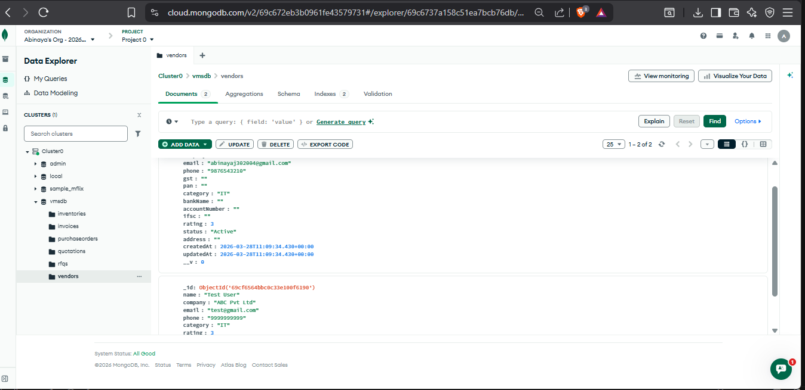

VendorPro — Vendor Management System

A full-stack MVP for managing vendors, RFQs, quotations, purchase orders, invoices, and inventory.


 Tech Stack

* **Backend:** Node.js, Express.js, MongoDB (Mongoose)
* **Frontend:** React.js, Tailwind CSS, Axios


## Project Structure

```
vms/
├── backend/
│   ├── controllers/
│   ├── models/
│   ├── routes/
│   ├── uploads/
│   ├── server.js
│   ├── seed.js
│   └── .env
└── frontend/
    ├── src/
    │   ├── pages/
    │   ├── components/
    │   └── utils/api.js
    └── public/
```


## Setup Instructions

 Prerequisites

* Node.js v18+
* MongoDB (local or Atlas)


 Backend Setup

```
cd backend
npm install
```

Create `.env` file:

```
PORT=5000
MONGO_URI=mongodb://localhost:27017/vms_db
```

Run backend:

```
npm run dev
```


 Frontend Setup

```
cd frontend
npm install
npm start
```


 App URLs

* Frontend: http://localhost:3000
* Backend: http://localhost:5000


## Features

* Vendor management (CRUD + upload)
* RFQ creation & vendor assignment
* Quotation submission & comparison
* Auto lowest price detection
* Purchase order generation
* Invoice with GST calculation
* Inventory tracking


## Notes / Trade-offs
- No JWT auth (simplified for MVP — easily added)
- GST hardcoded at 18% (configurable per invoice)
- File uploads store URL only (no cloud storag)

## Complete Workflow
```
1. Add Vendor → /vendors
2. Create RFQ → /rfqs (add items, set deadline)
3. Send RFQ to vendors
4. Submit Quotations → /quotations (vendor prices)
5. Compare Quotations → auto-flags lowest price
6. Select Quotation → auto-creates Purchase Order
7. Approve PO → /purchase-orders
8. Generate Invoice → auto-calculates 18% GST
9. Mark Invoice Paid → /invoices
10. Receive Inventory → /inventory (stock tracking)
```

---


### Relationships:
- **RFQ** has many **Vendors** (M:N) — stored as array of vendor IDs
- **Quotation** belongs to one **RFQ** and one **Vendor**
- **PurchaseOrder** references one **Quotation**, one **RFQ**, one **Vendor**
- **Invoice** belongs to one **PurchaseOrder** and one **Vendor**
- **Inventory** belongs to one **PurchaseOrder** and one **Vendor**

---

##  Architecture Diagram

┌─────────────────────────────────────────┐
│           FRONTEND (React.js)           │
│  Pages → Components → Axios API calls   │
└─────────────────┬───────────────────────┘
                  │  HTTP / JSON (REST API)
                  ▼
┌─────────────────────────────────────────┐
│         BACKEND (Node.js + Express)     │
│   Routes → Controllers → Mongoose ODM   │
└─────────────────┬───────────────────────┘
                  │  Mongoose queries
                  ▼
┌─────────────────────────────────────────┐
│         DATABASE (MongoDB Atlas)        │
│  vendors · rfqs · quotations · invoices │
└─────────────────────────────────────────┘


---

## ER Diagram (Text)
```
Vendor ──────┬──── RFQ
             │      │
             │      ▼
             │    Quotation ──── (selected) ──►  PurchaseOrder
             │                                        │
             │                                        ▼
             └────────────────────────────────────  Invoice
                                                        │
                                                        ▼
                                                    Inventory
```

##  Screenshots

### Dashboard


### Vendor Management


### RFQ Creation


### Quotation Comparison


### Cluster

